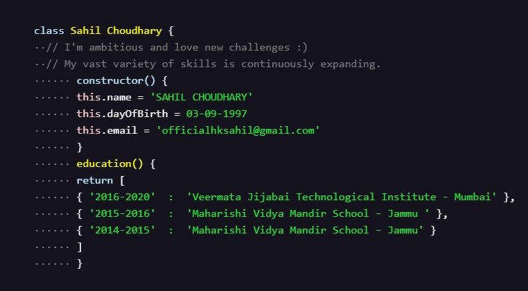

### Hi there, I'm Sahil Choudhary 👋

- 🌱 I’m currently learning everything 🤣
- 👯 I’m looking to collaborate with awesome developers and team
- 🥅 2020 Goals: Contribute to Open Source projects
- ⚡ Fun fact: I love to Binge Netflix and play games too.

### Connect with me:

[][linkedin]

[][quora]

 

### Languages and Tools:

 
 

### I have worked with these awesome Organizations:

 
 

### 📕 Latest Blog Posts

<!-- BLOG-POST-LIST:START -->

- [What happens when you click on a link in your Browser?](https://medium.com/@officialhksahil/what-happens-when-you-click-a-link-in-your-browser-c651f4890d29)
- [Must have tools for < Front-end web developers/ >](https://medium.com/@officialhksahil/must-have-tools-for-front-end-web-developers-a3388419e5a7)
- [How to use Social media(the good way)?](https://medium.com/@officialhksahil/how-to-use-social-media-the-good-way-745357d0d44c)
- [My journey from 2 Lakh answer views to 1 k views that too in 3 days](https://qr.ae/pN2war)
<!-- BLOG-POST-LIST:END -->

[linkedin]: https://www.linkedin.com/in/sahil-choudhary-258665125/
[quora]: https://www.quora.com/profile/Sahil-Choudhary-64
